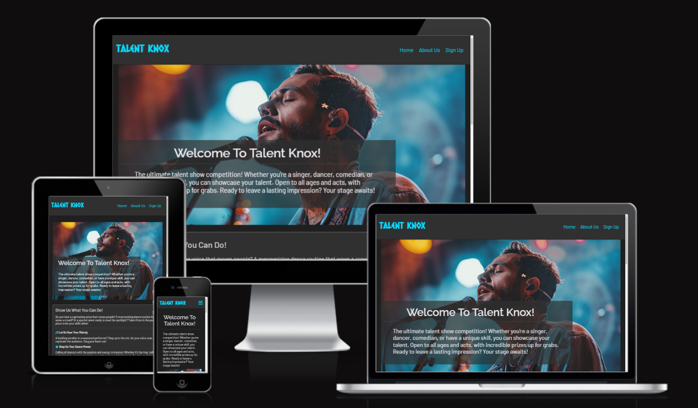
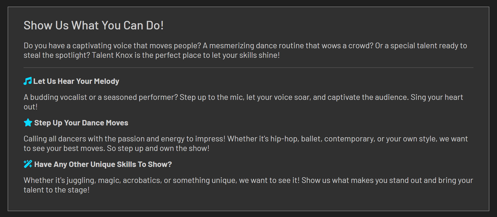
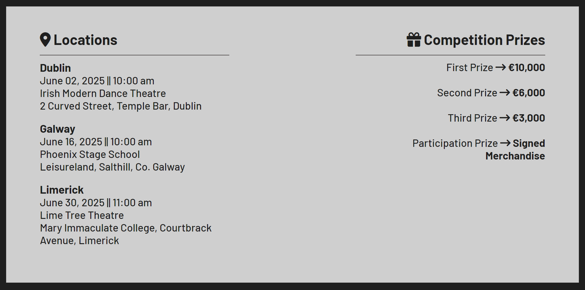
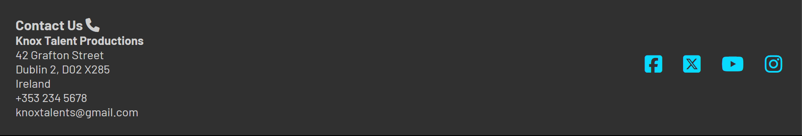
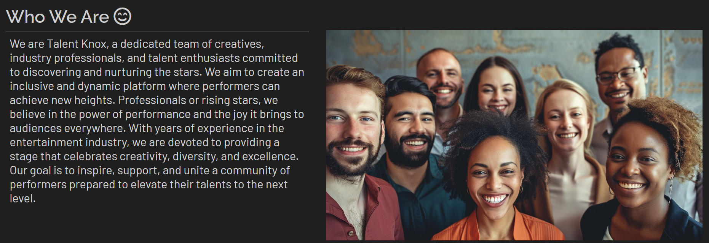
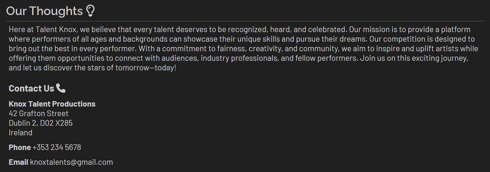
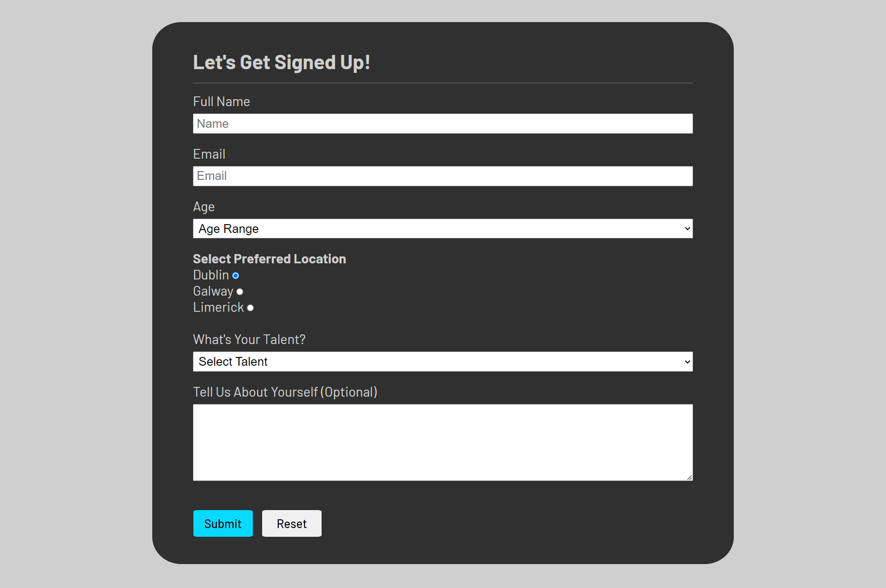
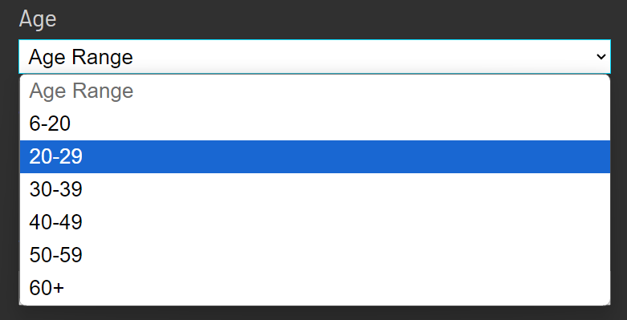
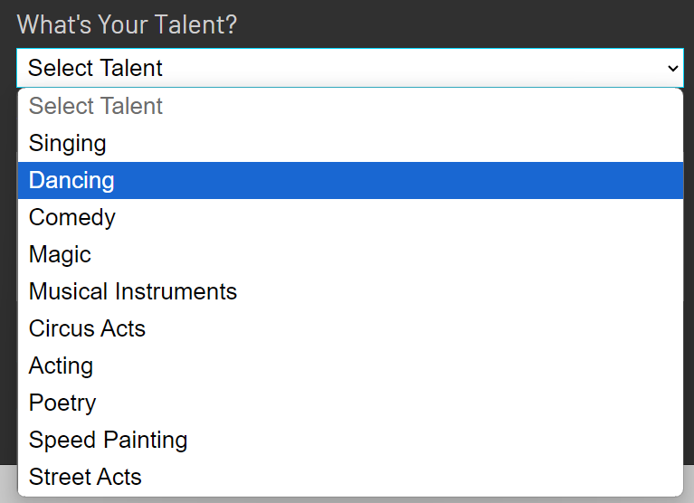

# Talent Knox

[view the full project here](https://taz1003.github.io/Portfolio-Project-1---Talent-Knox/)

Talent Knox is an open talent show competition designed to showcase a variety of skills. Singers, dancers, comedians, and individuals with unique abilities are all invited to take the stage and compete for incredible prizes. The competition is open to people of all ages and talents, providing a platform for them to perform and impress an audience.

Participants can showcase their talents in different categories, including singing, dancing, and other unique skills such as magic, acrobatics, or juggling. The focus is on captivating the crowd with standout performances, whether through mesmerizing dance routines, powerful vocal performances, or one-of-a-kind acts. The call-to-action encourages performers to step up, take the spotlight, and make a lasting impression.

## Features
A fully responsive and modern style three-page website that has good accessilbilty to the users. Some features are as follows:

- __Navigation Bar (Header)__
  - A navigation bar that is fully responsive is uniformly featured on all three pages. It has links to the Home page, About Us page and Sign Up page through the logo, 'Home', 'About Us' and 'Sign Up' links respectively.
  - This navigation section will help users to move between pages on any device, from mobiles to high resolution screens, without the hassle of clicking through the back button.

  

- __The landing page__
  - For mobile users, a friendly introduction with comprehensive information about what users can expect is provided, along with a captivating image designed to grab their attention.
  - For users with larger screen sizes, the introduction and image are creatively merged.

   

- __The 'Show us what you can do' (Overview) section__
  - This section will allow users to view a brief overview of the options available for showcasing their talent in the competition.

  

- __Competition Information section__
  - This section will provide the users information about the competition locations, dates, times, and prizes for first, second, third place, and participation.

  

- __Footer__
  - Properly aligned and fully responsive 'Contact Us' and 'Social media link icons' sections are presented to the users in the footer that matches the color contrast of the website.
  - The social media icons change appearances if cursors are hovered on them.

  

### About US (second page)
  - The second page contains a short biography of the coordinators of the Talent Knox competition.

  

  - Additionally, there is a snippet about the thoughts the coordinators have regarding this competition. It also includes a "Contact Us" section that provides the user with address, phone number, and email address. 

  

- __Gallery section__
  - The gallery will provide the user with supporting images to visualize the competition.
  - This section is important for users as it helps them easily identify the types of events organized by the coordinators.

  

### Sign Up (third page)
  - This page will assist interested users in signing up for the competition. They can choose their age from an age-range selector, indicate the location, and select the talent they will be showcasing. An optional 'write about yourself' description box is included provided they are interested. The fully functional submit and reset button, change appearances when hovered upon.

  
  
  

## Features Left to Implement
  - More interactive functions like image enhancement in the gallery.
  - More pages explaining implementation various talents for the competition.

## Technologies Used
- __Languages Used__
  - HTML5
  - CSS3
    - Media queries were used to enable the responsiveness of the website for various screen sizes (490px+, 768px+, 992px+, 1200px+, 1800px+ and 2500px+)

- __Programmes, Libraries Used__
  1. __Chrome DevTools__
    - The built in DevTools programme in the Chrome internet browser was used all throughout the project to assist with responsiveness and styling of the website.
  2. __[Google Fonts](https://fonts.google.com/?preview.text=Welcome%20To%20Talent%20Knox!)__
    - Google Fonts were used to import 'Barlow' and 'Raleway' fonts into the style.css which were used all throughout the project.
  3. __[Font Awesome](https://fontawesome.com/)__
    - Font Awesome kit was used on all pages to add icons for aesthetic and UX purposes. The favicon was also created using this programme.
  4. __[Gitpod](https://www.gitpod.io/)__
    - All the coding were done using Gitpod, also the terminal was used to commit to git and push to Github.
  5. __[GitHub](https://github.com/)__
    - Github was used to store all the coding after being pushed from Gitpod.
  6. __[W3C Markup Validation Service](https://validator.w3.org/#validate_by_input) & [W3 Jigsaw CSS Validator](https://jigsaw.w3.org/css-validator/)__
    - W3C Markup Validator and W3 Jigsaw CSS Validator were used as testing and validating the HTML and CSS coding of all the pages and their styles.
  7. __[Screenfly](https://screenfly.org/)__
    - Screenfly was used to test the responsiveness of the website for various screen sizes. 

## Testing

  - __W3C Markup Validator__ - Results

 - __Bugs Fixed__
    - Fixed error with the help of [W3C Markup Validation Service](https://validator.w3.org/#validate_by_input) that occured in lines 121-127 in the index.html. Fix was done by removing 'br' attributes from the 'ul' attribute. 
  
    - Fixed error that was occuring in lines 94-109 in the signup.html page because there was no 'disabled' Option value as a placeholder for the Select attribute. Fix was done with the help of [W3 HTML reference page](https://www.w3schools.com/tags/tag_option.asp).

    - Fixed spelling error of the image path in line 61 in the about.html page that occured during the usage of [W3C Markup Validator](https://validator.w3.org/#validate_by_input).
