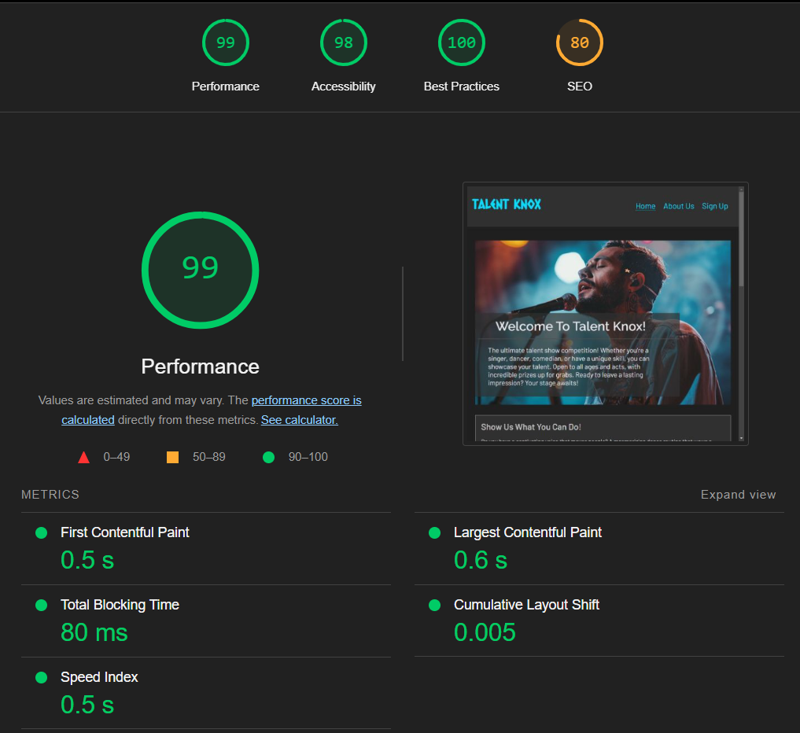

# Talent Knox

[view the full project here](https://taz1003.github.io/Portfolio-Project-1---Talent-Knox/)

Talent Knox is an open talent show competition designed to showcase various skills. Singers, dancers, comedians, and individuals with unique abilities are all invited to take the stage and compete for incredible prizes. The competition is open to people of all ages and talents, providing a platform for them to perform and impress an audience.

Participants can showcase their talents in different categories, including singing, dancing, and other unique skills such as magic, acrobatics, or juggling. The focus is on captivating the crowd with standout performances through mesmerizing dance routines, powerful vocal performances, or one-of-a-kind acts. The call-to-action encourages performers to step up, take the spotlight, and make a lasting impression.

## Features
Keeping in mind good User Experience Design (UXD), I have created a fully responsive and modern three-page website with excellent accessibility for users. Some of the key features include:

- __Navigation Bar (Header)__
  - A fully responsive navigation bar is uniformly featured on all three pages. It has links to the Home page, About Us page, and Sign Up page through the logo, 'Home', 'About Us', and 'Sign Up' links respectively.
  - This navigation section will help users to move between pages on any device, from mobiles to high-resolution screens, without the hassle of clicking through the back button.

  

- __The landing page__
  - For mobile users, a friendly introduction with brief information about what users can expect is provided, with a captivating image right below that is designed to grab their attention.
  - For users with larger screen sizes, the introduction and image are creatively merged.

   

- __The 'Show us what you can do' (Overview) section__
  - This section will allow users to view a brief overview of the options available for showcasing their talent in the competition.

  

- __Competition Information section__
  - This section will provide the users' information about the competition locations, dates, times, and prizes for first, second, and third place, and participation.

  

- __Footer__
  - Properly aligned and fully responsive 'Contact Us' and 'Social media link icons' sections are presented to the users in the footer that matches the color contrast of the website.
  - The social media icons change appearances if cursors are hovered on them.

  

### About US (second page)
  - The second page contains a short biography of the coordinators of the Talent Knox competition.

  

  - Additionally, there is a snippet about the thoughts the coordinators have regarding this competition. It also includes a "Contact Us" section that provides the users with an address, phone number, and email address.

  

- __Gallery section__
  - The gallery will provide the user with supporting images to visualize the competition.
  - This section is important for users as it helps them easily identify the types of events organized by the coordinators.

  

### Sign Up (third page)
  - This page will assist interested users in signing up for the competition. They can choose their age from an age-range selector, indicate the location, and select the talent they will be showcasing. An optional 'write about yourself' description box is included provided they are interested. The fully functional submit and reset button changes appearances when hovered upon.

  
  
  

## Features Left to Implement
  - More interactive functions like image enhancement in the gallery.
  - More pages explaining the implementation of various talents for the competition.

## Technologies Used
- __Languages Used__
  - HTML5
  - CSS3
    - Media queries were used to enable the responsiveness of the website for various screen sizes (490px+, 768px+, 992px+, 1200px+, 1800px+, and 2500px+)

- __Programmes, Libraries Used__
  1. __Chrome DevTools__
     - The built-in DevTools program in the Chrome internet browser was used throughout the project to assist with responsiveness and styling of the website.
  2. __[Google Fonts](https://fonts.google.com/?preview.text=Welcome%20To%20Talent%20Knox!)__
     - Google Fonts were used to import 'Barlow' and 'Raleway' fonts into the style.css which were used throughout the project.
  3. __[Font Awesome](https://fontawesome.com/)__
     - Font Awesome kit was used on all pages to add icons for aesthetic and UX purposes. The favicon was also created using this website.
  4. __[Gitpod](https://www.gitpod.io/)__
     - All the coding was done using Gitpod, also the terminal was used to commit to git and push to Github.
  5. __[GitHub](https://github.com/)__
     - Github was used to store all the coding after being pushed from Gitpod.
  6. __[W3C Markup Validation Service](https://validator.w3.org/#validate_by_input) & [W3 Jigsaw CSS Validator](https://jigsaw.w3.org/css-validator/)__
     - W3C Markup Validator and W3 Jigsaw CSS Validator were used to test and validate the HTML and CSS coding of all the pages and their styles.
  7. __[Screenfly](https://screenfly.org/)__
     - Screenfly was used to test the responsiveness of the website for various screen sizes.
  8. __[Grammarly](https://app.grammarly.com/)__
     - Grammarly extension was used in grammar and spell-checking as well as improving all the descriptive content of the website.
  

## Testing
  - I tested that this website works perfectly in different browsers: Chrome, Firefox, Opera GX, Edge, etc.
  - I confirmed that this website is responsive, looks aesthetically pleasing and functions properly on all standard screen sizes using the Chrome DevTools and Screenfly, as well as using different mobile phones.
  - I confirmed that the links and styles presented in the nav bar and the footer works perfectly as intended in all screens and browsers.
  - I have confirmed that the sign up form works flawlessly including the age and talent selectors, submit and the reset buttons.

 - __Bugs Fixed__
    - Fixed error with the help of [W3C Markup Validation Service](https://validator.w3.org/#validate_by_input) that occurred in lines 121-127 in the index.html. The fix was done by removing the 'br' attributes from the 'ul' attribute.
 
    - Fixed error that was occurring in lines 94-109 in the signup.html page because there was no 'disabled' Option value as a placeholder for the Select attribute. The fix was done with the help of [W3 HTML reference page](https://www.w3schools.com/tags/tag_option.asp).

    - Fixed spelling error of the image path in line 61 in the about.html page that occurred during the usage of [W3C Markup Validator](https://validator.w3.org/#validate_by_input).

  - __Validator Testing__
    - [W3C Markup Validator](https://validator.w3.org/#validate_by_input)
      - After running the code in index.html through the W3C Markup Validator for the final time, no errors were found. However, there was one warning about the placement of 'h1' in line 49, which does not affect the website's functionality or interfere with any other code. Everything else is working perfectly.
      - No errors or issues were returned when running the code present in about.html and signup.html pages through the W3C Markup Validator.
    - [W3 Jigsaw CSS Validator](https://jigsaw.w3.org/css-validator/)
      - No errors or issues were returned after running the code present in style.css file through the W3 Jigsaw CSS Validator.
    - Accessibility
      - I confirmed that the colors, images and fonts used in this website are easy to read and accessible by running it through lighthouse in Chrome DevTools.

        

## Deployment
  - The website was deployed to Github. The steps to deploy are as follows:
    - Login to [Github](https://www.gitpod.io/) and locate the targeted repository from the repositories menu.
    - Navigate to the settings tab and locate 'Default Branch' section.
    - Change the source from 'none' to 'main'
    - Refresh the page (if not automatically refreshed) and navigate back to the Code tab.
    - At the right side, in the Deployments section, click on github-pages and the published link will be presented there.
  
  view the live website link here - [Talent Knox](https://taz1003.github.io/Portfolio-Project-1---Talent-Knox/)